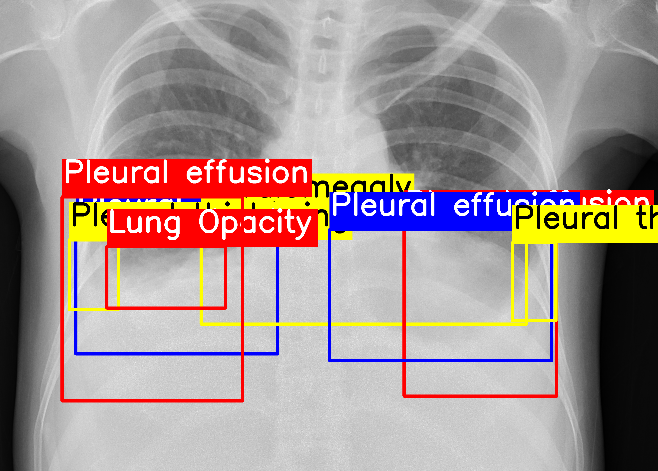

# Bayesian Detector Combination for Object Detection with Crowdsourced Annotations

## Description
<p align="justify">
Acquiring fine-grained object detection annotations in unconstrained images is time-consuming, expensive, and prone to noise, especially in crowdsourcing scenarios. Most prior object detection methods assume accurate annotations; A few recent works have studied object detection with noisy crowdsourced annotations, with evaluation on distinct synthetic crowdsourced datasets of varying setups under artificial assumptions.
To address these algorithmic limitations and evaluation inconsistency, we first propose a novel Bayesian Detector Combination (BDC) framework to more effectively train object detectors with noisy crowdsourced annotations, with the unique ability of automatically inferring the annotators' label qualities.
Unlike previous approaches, BDC is model-agnostic, requires no prior knowledge of the annotators' skill level, and seamlessly integrates with existing object detection models. 
Due to the scarcity of real-world crowdsourced datasets, we introduce large synthetic datasets by simulating varying crowdsourcing scenarios. This allows consistent evaluation of different models at scale.
Extensive experiments on both real and synthetic crowdsourced datasets show that BDC outperforms existing state-of-the-art methods, demonstrating its superiority in leveraging crowdsourced data for object detection.

<div align="center" style="width:80%;">

|   <br>(a)   |  <br>(b)   |    <br>(c)    |
|:---------------------------------------:|:---------------------------------------:|:------------------------------------------:|
| <br>(d)   | <br>(e)  | <br>(f) |

</div>
<p align="center">Figure 1: Examples of ambiguous cases with noisy or incorrect annotations on (a - c) MS COCO, (d)(e) VinDr-CXR and (f) disaster response dataset.
</p>
<p align="center"></p>
<p align="center">Figure 2: Overall architecture of the proposed BDC. The process of updating the aggregator's parameter (blue arrows) and the object detector's parameters (red arrows) is repeated iteratively until convergence. 
</p>

## Setup Environment
1. Install required libraries by running 
    ```bash
    conda create -n bdc python=3.8
    conda activate bdc
    pip install torch==1.13.1+cu117 torchvision==0.14.1+cu117 torchaudio==0.13.1 --extra-index-url https://download.pytorch.org/whl/cu117
    pip install -r requirements.txt
    ```
   Alternatively, install from conda yaml file with `conda env create -f env.yaml`
2. Install optional libraries for EVA model
    - Install [Apex](https://github.com/NVIDIA/apex/tree/22.12-dev) v22.12
    ```bash
    # install xformers for eva02 https://github.com/facebookresearch/xformers/tree/v0.0.16
    pip install xformers==0.0.16
    # compile detectron2
    cd models/eva
    python -m pip install -e .
    cd ../../
    pip install mmcv-full==1.7.1 -f https://download.openmmlab.com/mmcv/dist/cu117/torch1.13.0/index.html
    ```
3. Download pretrained model weights (optional)
    ```bash
    mkdir pretrained_weights
    cd pretrained_weights
    wget https://github.com/WongKinYiu/yolov7/releases/download/v0.1/yolov7_training.pt
    wget https://huggingface.co/Yuxin-CV/EVA-02/resolve/main/eva02/det/eva02_L_coco_det_sys_o365.pth
    ```

## Dataset
Download our synthesised crowdsourced annotations from [here](). Extract and place the annotations in `data` directory.
Please download [Pascal VOC](http://host.robots.ox.ac.uk/pascal/VOC), [MSCOCO](https://cocodataset.org/#home) and [VinDr-CXR](https://www.kaggle.com/c/vinbigdata-chest-xray-abnormalities-detection/overview) and place the images in `.data` directory following this structure:
```
.
└── .data/
    ├── MSCOCO/
    │   ├── annotations
    │   └── images
    ├── VINCXR/
    │   ├── train
    │   └── test
    └── VOCdevkit/
        └── VOC2007/
            ├── Annotations
            └── JPEGImages
```
### Preparing custom datasets
1. Convert your annotations to YOLO labelling format (one txt file per image).
   - Train annotations follows format: x1,y1,x2,y2,class_id,annotator_id
   - Test annotations (if available, else create empty text file for each test image) follows format: x1,y1,x2,y2,class_id
2. Create a new yaml file and modify the settings in it followingthe examples in `data` folder.


## How to run
Run the scripts with `--help` argument to see arguments descriptions:
- Specify the aggregation method with `--crowd-aggregator` argument, available aggregators are in `config` directory
- Specify the project name and experiment name with `--project` and `--name` arguments (experiment outputs are saved to `outputs/<project>/<name>`)
- Specify the data yaml file with `--data` argument 

Examples below train YoloV7, Faster R-CNN and EVA model on our simplest synthetic dataset: `VOC-FULL` using our proposed BDC aggregation method
```bash
python train_yolov7.py --project crowd-annotations-voc --plots --batch-size 31 --weights ./pretrained_weights/yolov7_training.pt --crowd-aggregator config/bdc.yaml --name ann10_full-yolov7_pretrained-bdc --data data/voc_2007_ann10_full.yaml
python train_faster_rcnn.py --project crowd-annotations-voc --plots --batch-size 8 --crowd-aggregator config/bdc.yaml --name ann10_full-frcnn_pretrained-bdc --data data/voc_2007_ann10_full.yaml
python train_eva.py --project crowd-annotations-voc --plots --crowd-aggregator config/bdc.yaml --name ann10_full-eva_pretrained-bdc --data data/voc_2007_ann10_full.yaml
```

Examples below train YoloV7, Faster R-CNN and EVA model on our synthetic dataset `COCO-MIX` using our proposed BDC aggregation method
```bash
python train_yolov7.py --cfg ./models/yolov7/config/yolov7_coco.yaml --epochs 20  --save-after 5 --save-interval 5 --project crowd-annotations-coco --plots --batch-size 31 --weights ./pretrained_weights/yolov7_training.pt --crowd-aggregator config/bdc.yaml --name ann1000_mix-yolov7_pretrained-bdc --data data/coco_ann1000_mix_disjoint.yaml
python train_faster_rcnn.py --project crowd-annotations-coco --plots --epochs 10 --save-after 5 --save-interval 1 --batch-size 8 --crowd-aggregator config/bdc.yaml --name ann1000_mix-frcnn_pretrained-bdc --data data/coco_ann1000_mix_disjoint.yaml
python train_eva.py --project crowd-annotations-coco --plots --epochs 10 --crowd-aggregator config/bdc.yaml --name ann1000_mix-eva_pretrained-bdc --data data/coco_ann1000_mix_disjoint.yaml
```
All experiments are logged to Tensorboard and WandB automatically. They can be disabled in the training codes.

## Crowdsourced Annotations Synthesisation
The code to synthesise the synthetic datasets are implemented in Jupyter notebooks in `notebook` directory. Please refer to the notebooks `synthetic_*.ipynb` for more details.
Synthesisation code (with docstrings) can also be found in `utils.crowd.synthetic_data.py`.

General steps to synthesise annotations are as follows:
1. Prepare your custom dataset following instructions [above](#preparing-custom-datasets)
2. Run `train_classification.py` to train classification model and `test_classification.py` to obtain the confusion matrix for synthesising class labels
3. Run `train_rpn.py` to train RPN model for synthesising bounding boxes
4. Follow steps in the notebooks to synthesise annotations and modify according to your desired synthetic setting (changing number of annotators, changing classification and RPN models, etc.)

## Citation
If you find this work useful for your research, please cite our work as
```bibtex
@inproceedings{bdc2024tan,
   title={},
   author={},
   booktitle={},
   pages={},
   year={},
}
```

## Feedback
Suggestions and opinions on this work (both positive and negative) are greatly welcomed. Please contact the authors by sending an email to
`zhiqin1998 at hotmail.com`.

## License and Copyright
The project is open source under BSD-3 license (see the ``` LICENSE ``` file).